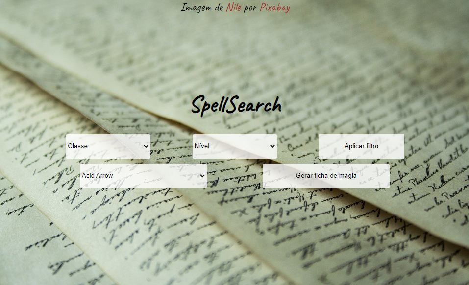

# SpellSearch

> Selecione o filtro que você deseja, caso desejar algum, e em seguida escolha a magia que quer pesquisar e pressione o botão "Gerar ficha de magia" para gerar uma ficha com as informações da sua magia.
### Ajustes e melhorias

O projeto ainda está em desenvolvimento e as próximas atualizações serão voltadas nas seguintes tarefas:

- [ ] Melhorar a interface

## ☕ Usando SpellSearch

Para usar SpellSearch, clique [aqui!](https://joaopedrov0.github.io/spellsearch/)
